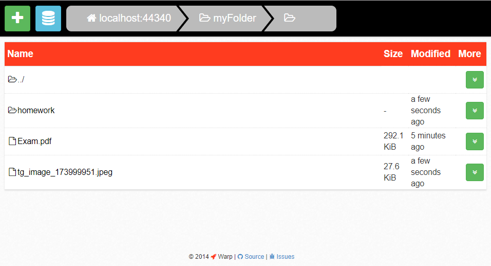
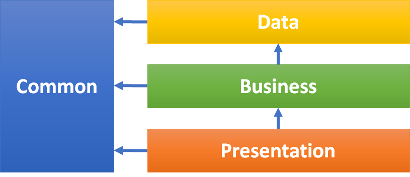

# .NET LDP-server

This is an implementation of a LDP server that allows to store and download files. The idea is that this server could be used with the [Solid](https://solid.inrupt.com/) platform, where users can choose their own server/service to store their personal data. An example of such a client is [Warp](https://github.com/linkeddata/warp), which is a file-manager that allows to create or delete directories. And it allows to upload or download files.

## Design
Files and directories are stored on the server's file-system in ```%AppData%/LDPServer```. The server is implemented on top ASP.NET Web API 2. The application is designed according to Three-tier architecture. In the project dependency injection is used, also during design decoupling dependencies was kept in mind.


